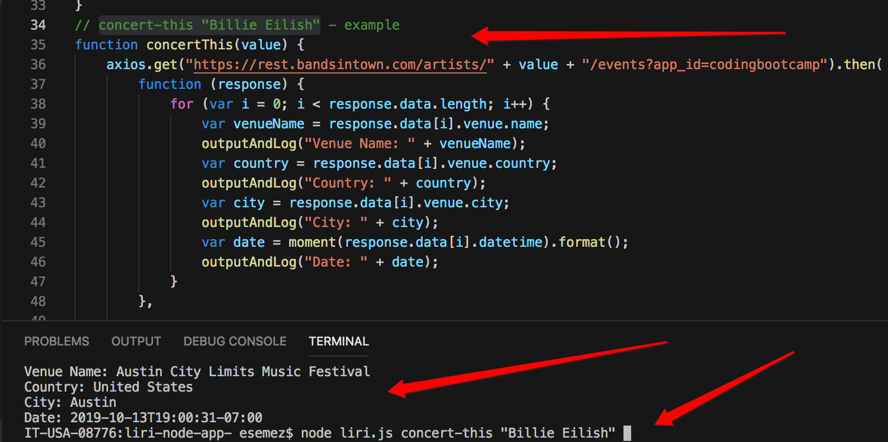
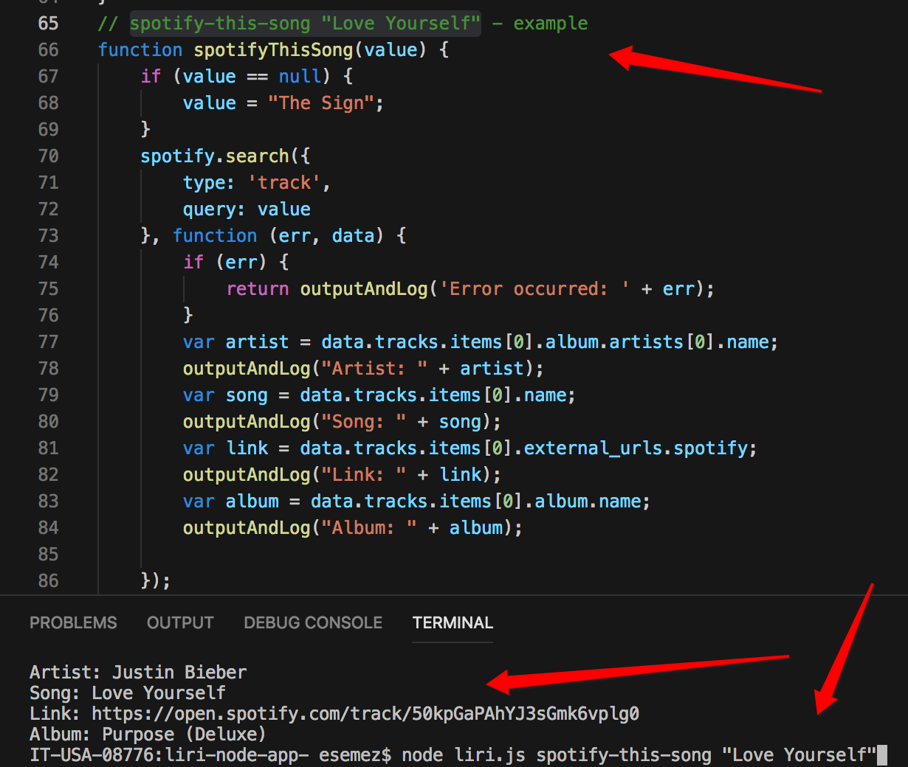
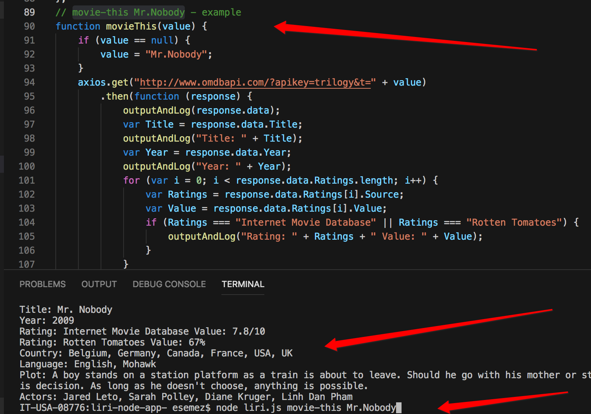
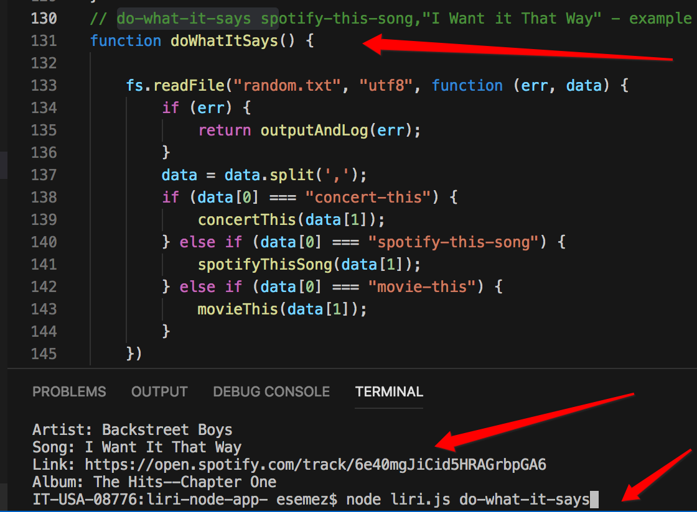

# liri-node-app-

This app allows to search for your favorite artist, album, and get more information on it like released year, country it was made, language it supports. By just typing a particular command user can get an extra knowledge and feel up to date with new artists and albums releaved.

## Installation
For the first example i used axios to get "https://rest.bandsintown.com/artists/"
For the second example i used spotify.search
For the third axios to get "http://www.omdbapi.com/?apikey=trilogy&t="
Also added random.txt and log.txt files
Installed all important packages: package.json, package-lock.json

## User test cases
1. using "concert-this"
All you have to do is to type concert-this "Billie Eilish" in the command line 
and get a result
here is a screenshot:

2. using "spotify-this-song"
All you have to do is to type spotify-this-song "Love Yourself" in the command line
and get a result
here is a screenshot:

3. using "movie-this"
All you have to do is to type movie-this Mr.Nobody
and get a result
here is a screenshot: 

4. using do-what-it-says 
All you have to do is to type do-what-it-says
Also you can command + link and watch/listen the actual song
here is a screenshot: 

Check the log.txt file - all the search is saved there in the readable form.